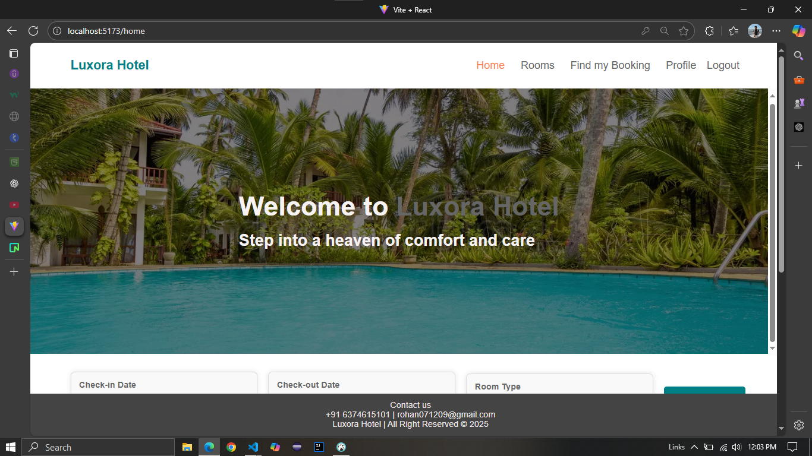

# 🏨 Advanced Hotel Management System — Backend

An **Advanced Hotel Management System** built with **Spring Boot** to streamline hotel operations such as room booking, customer check-in/out, billing, and real-time room availability tracking.  
Designed for **efficiency, scalability, and ease of use** for hotel staff and administrators.

---

## 📌 Features

### 🔐 Authentication & Authorization
- Secure login & registration with password encryption.
- Role-based access control (Admin, User).
- Spring Security integration.

### 🏨 Hotel Management
- **Rooms**: Add, update, delete, and fetch room details.
- **Bookings**: Create and manage hotel bookings.
- **Users**: Manage user profiles and credentials.

### ☁ Cloud Integration
- **Neon DB (PostgreSQL)** for high-performance cloud database hosting.
- **AWS S3** for image uploads and storage.

### ⚙ Developer-Friendly
- Dockerized for easy deployment.
- Configurable via environment variables.
- Organized Spring Boot layered architecture.

---

## 🛠 Tech Stack

- **Backend Framework:** Spring Boot (Java 17)  
- **Frontend:** React (JS) — [Frontend Repo](https://github.com/Rohan07github/Hotel-Management-Frontend)  
- **Database:** PostgreSQL (Neon DB)  
- **Cloud Storage:** AWS S3  
- **Build Tool:** Maven  
- **Deployment:** Render (Backend), Vercel (Frontend)  
- **Security:** Spring Security, BCrypt  
- **Version Control:** Git & GitHub  

---

## 🚀 Installation & Setup

1. **Clone the repository**
   ```bash
   git clone https://github.com/Rohan07github/Hotel-Management-Backend.git
   cd Hotel-Management-Backend
---
2. Configure environment variables
   
spring.datasource.url=jdbc:postgresql://<NEON_DB_URL>/<DB_NAME>
spring.datasource.username=<DB_USER>
spring.datasource.password=<DB_PASSWORD>

aws.s3.bucket-name=<BUCKET_NAME>
aws.access-key=<ACCESS_KEY>
aws.secret-key=<SECRET_KEY>

3.mvn clean install
4.mvn spring-boot:run

5.Access the API
http://localhost:8080


## 📷 Screenshots




## 🤝 Contributing

Contributions are welcome!  
If you’d like to improve this project, please fork the repository and create a pull request.

---

## 📜 License

This project is licensed under the **MIT License** – feel free to use and modify it.

---

👨‍💻 Author
Rohan — Full-stack Developer

GitHub: [Rohan07github](https://github.com/Rohan07github)

LinkedIn: www.linkedin.com/in/rohanj07

Email: rohan071209@gmail.com
